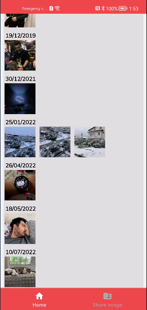
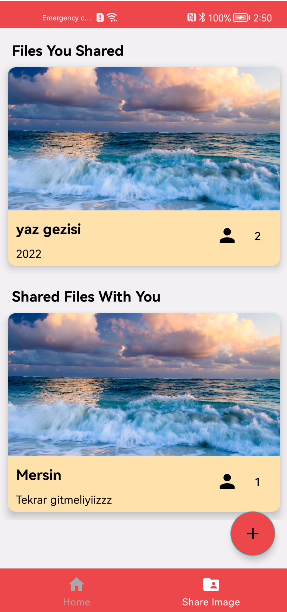
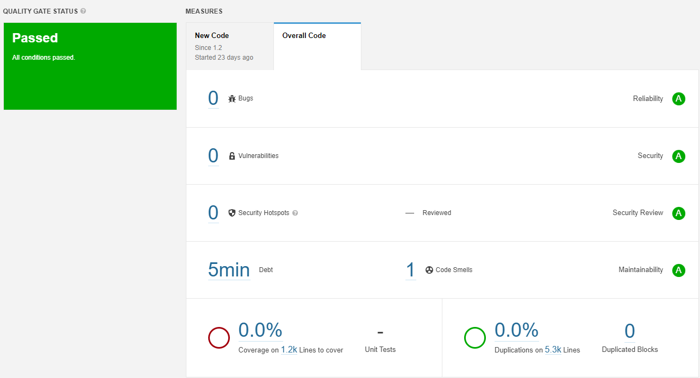

# PhotographyApp

## Screenshots

<table>
<tr>
<td>

</td>

<td>

</td>

<td>

</td>

<td>

</td></tr>

<tr>
<td>

</td>

<td>

</td>

<td>

</td>

<td>

</td></tr>

</table>

## 📔 Introduction

PhotographyApp is a reference application for HMS Kits to phones running with the android based HMS
Service. PhotographyApp basically is an app which has everything you could want from a photo app. It
can separate your photos by tags thanks to ML kit feature. It can cluster your photos based on
locations and you will be able too see that clusters on the map. You can display that clustered
photos by click on cluster and it display the photos in order by date. It displays all photos from
gallery and after click a photo you can edit that photo and you can save it to gallery. You can
share that photo too. Apart from all these good features, the feature which we are proud of you can
create a space for sharing photos. In these space you will be define title and description and you
can select users to share. You can select ANY user who is using the app. After the selection the
space will be created and in this space, you will be able to select photos by clicking select photo.
You can select photo from files and gallery. The page also displays recent images on phone.

# 📱 Features

### Image Classification

-----
Thanks
to [Huawei ML Kit Image Classification](https://developer.huawei.com/consumer/en/doc/development/hiai-Guides/image-classification-0000001050040095)
our app can separate your photos by tags and you can display all photos which has same tags.

### Location Based Photo Displaying

-----
Thanks to [Huawei Map Kit](https://developer.huawei.com/consumer/en/hms/huawei-MapKit/) and our
colleague's library
[100K Clustered Markers with Huawei Map! 😱](https://medium.com/huawei-developers/100k-clustered-markers-with-huawei-map-ffcba4168727)
PhotographyApp can display photos on map with clustering. By this way you can easily find your
photos which where they were taken and display it. When clicked the cluster you can display the
photos by date.

### Display Photos On The Device and Image Editing

-----
You can display the photos on your device and by clicking the photo, thanks to [Huawei Image Kit](https://developer.huawei.com/consumer/en/doc/development/Media-Guides/service-introduction-0000001050199011/), you can edit the chosen photo. Also you can share the
edited photo.

### Sharing Space

-----
Thanks to [Huawei Cloud DB](https://developer.huawei.com/consumer/en/agconnect/cloud-base/)
you can create a space which you can share photos. For doing that, you need to declare a title and
description for your space, after that declaration you need to choose persons with whom to share it.
You can choose anyone who is using the PhotographyApp.

## 💻 Tech Stack & Used Kits

PhotographyApp is designed with MVVM (Model-View-ViewModel), Repository design patterns and Kotlin
is used for development.

### Used Kits

✅ [HUAWEI AUTH SERVICE](https://developer.huawei.com/consumer/en/agconnect/auth-service/) \
✅ [HUAWEI MAP KIT](https://developer.huawei.com/consumer/en/hms/huawei-MapKit/) \
✅ [HUAWEI MACHINE LEARNING KIT](https://developer.huawei.com/consumer/en/hms/huawei-mlkit/) \
✅ [HUAWEI CLOUD DB](https://developer.huawei.com/consumer/en/agconnect/cloud-base/) \
✅ [HUAWEI IMAGE KIT](https://developer.huawei.com/consumer/en/hms/huawei-imagekit/)

### Tech Stack

✅ [Hilt (DI)](https://developer.android.com/training/dependency-injection/hilt-android)     \
✅ [Architecture Components (DataBinding, ViewModel, LiveData)](https://developer.android.com/topic/libraries/architecture/viewmodel)     \
✅ [Coroutines](https://developer.android.com/kotlin/coroutines)     \
✅ [Flow](https://developer.android.com/kotlin/flow)     \
✅ [Jetpack Navigation component](https://developer.android.com/guide/navigation)     \
✅ [Glide](https://github.com/bumptech/glide)     \
✅ [Room DB](https://developer.android.com/training/data-storage/room) \
✅ [Material Design](https://material.io/develop/android)  \
✅ [EXIF Interface](https://developer.android.com/reference/android/media/ExifInterface) \
✅ [Safe Args](https://developer.android.com/guide/navigation/navigation-pass-data)

## Try the App - What You Will Need

- A computer that can run Android Studio.
- An android device with Hms Core installed and OS version Android 7 or higher (minSdk is API 24)
- Fork this repo by clicking top right and clone it to your computer.
- You need to AGConnect-Services.json file to run this project properly. Follow the below steps to
  obtain it.
    - [Create Huawei Developer Account if you haven't got an account](https://developer.huawei.com/consumer/en/doc/start/10104)
    - Go to the app-level build.gradle file and change the application id of the project. (You don't
      need to change the package name in the whole repo.)
    - [Create a SignIn Certificate with key0 alias, ExploreLandmarks password and named as ExploreLandmarks.jks](https://medium.com/@corruptedkernel/android-creating-a-signing-certificate-keystore-and-signing-your-apk-fa67fdd27cf)
      . Actually this password and alias are not mandatory but if you want to sign with different
      alias or password please don't forget to change needed information in build.gradle (app:level)
      to with new information. Replace this file with ExploreLandmarks.jks which already exist on
      the app directory.
    - [Generate SHA-256 Fingerprint via Keytool](https://medium.com/@corruptedkernel/android-generating-fingerprint-from-a-keystore-jks-file-b624bacd90fd)
      or running the signingReport task (View => Tool Windows => Gradle => Tasks => Android =>
      signingReport)
    - Login to [Huawei Developer Console](https://developer.huawei.com/consumer/en/console) if you
      didn't log in.
    - [Create a new  app with the new applicationId in AppGallery and integrate the repo with it](https://medium.com/huawei-developers/android-integrating-your-apps-with-huawei-hms-core-1f1e2a090e98) (
      Creating an app, adding SHA-256 to AppGallery Connect, Downloading AgConnectServices.json
      file)
    - Before downloading agconnect-services.json choose a Data Processing Location on Project
      Settings -> General Information (I recommended Germany because I use it and the search feature
      is worked properly with it.).
    - Before downloading and moving agconnect-services.json file to the "app" folder,
      please [make enable necessary services](https://developer.huawei.com/consumer/en/doc/distribution/app/agc-help-enabling-service-0000001146598793)
      . For this project you have to set enable Auth Service, Map Kit, ML Kit, Image Kit and Cloud
      DB.
    - Go to Cloud DB zone create a new DB Zone for the app. Then add these object types with same
      fields. Naming is important. Then change DB name in the CloudDBRepository with the same you've
      created in AppGallery Connect. If you encountered with an error please check models and object
      type fields.

  
  
  
  

- You need to client id and client secret to obtain an access token from Account Kit via OAuth-based
  authentication. [Get this information](https://developer.huawei.com/consumer/en/doc/distribution/app/agc-help-appinfo-0000001100014694)
  under Project Settings => General Information => App information => OAuth 2.0 client ID section
  and add them into app level build.gradle file.
- [You need to app id for Search Kit](https://developer.huawei.com/consumer/en/doc/development/HMSCore-Guides/integrating-sdk-0000001057023645)
  . Take the "app_id" value from the agconnect-services.json file and set it to the AGC_APP_ID_VALUE
  value in the application level build.gradle file.
- [You need to add the API key for using ML Kit on cloud services](https://developer.huawei.com/consumer/en/doc/development/hiai-Guides/add-appgallery-0000001050038080)
  Take the "api_key" value from the agconnect-services.json file and set it to the API_KEY_VALUE
  value in the application level build.gradle file.
- Solution of some issues you might be faced
    - Error Code 907135000 : Please move agconnect-services.json file under to app directory.
    - Error Code
      6003 : [Enable App Signing by choosing "Let AppGallery Connect create and manage app signature for me"](https://developer.huawei.com/consumer/en/doc/development/AppGallery-connect-Guides/agc-appsigning-newapp-0000001052418290)

## Sonarqube Report ✅

P.S.: We are aware we have code smells according to sonarqube report. The reason of these in Cloud
DB our naming can't pass the sonarqube. We will fix this issues in next version.

## Contributors

- [Mehmet Yozgatli](https://www.linkedin.com/in/mehmetyozgatlii/)
- [Salih Sertac Ayhan](https://www.linkedin.com/in/srtcayhan/)
- [Oguz Sahin](https://www.linkedin.com/in/oguzsahinn/)

## License

     Licensed under the Apache License, Version 2.0 (the "License");
    you may not use this file except in compliance with the License.
    You may obtain a copy of the License at

       http://www.apache.org/licenses/LICENSE-2.0

    Unless required by applicable law or agreed to in writing, software
    distributed under the License is distributed on an "AS IS" BASIS,
    WITHOUT WARRANTIES OR CONDITIONS OF ANY KIND, either express or implied.
    See the License for the specific language governing permissions and
    limitations under the License.
